# SpecOps Overlay

SpecOps Overlay is a technology-agnostic agent delivery overlay for OpenSpec.
It strengthens elicitation, scope discipline, task-time proof, and evaluation
around OpenSpec's native lifecycle. It does not replace OpenSpec, and it does
not guarantee implementation quality by itself; it gives agents and reviewers a
clearer contract for finding risks, proving acceptance criteria, and recording
what was actually validated.

It is not a runnable application or service by itself. An adopting repository
must fill in its own runtime facts, commands, architecture, tests,
integrations, and operational constraints before relying on agents for code
changes.

Tool-specific OpenSpec command and skill files are intentionally not versioned
in this overlay. Generate them in each adopting repository with
`openspec init` so the selected tools, workflow profile, and installed OpenSpec
version decide the final files.

## Contents

- [What SpecOps Overlay Adds](#what-specops-overlay-adds)
- [Complete Overlay Workflow](#complete-overlay-workflow)
- [Change Sizing](#change-sizing)
- [Core And Flavors](#core-and-flavors)
- [Flavor Strategy](#flavor-strategy)
- [State And Handoff](#state-and-handoff)
- [Knowledge Verification](#knowledge-verification)
- [Repository Contents](#repository-contents)
- [How To Adopt SpecOps Overlay](#how-to-adopt-specops-overlay)
- [Local Validation](#local-validation)
- [OpenSpec Setup](#openspec-setup)
- [Licensing](#licensing)
- [Contributing](#contributing)

## What SpecOps Overlay Adds

OpenSpec gives a repository structure for proposals, specs, tasks, apply, sync,
and archive. SpecOps Overlay adds the project context and quality gates around
that lifecycle:

- progressive loading of only the project docs needed for the task;
- `docs/project/*` as the stable contract for architecture, stack, structure,
  conventions, testing, integrations, and concerns;
- pre-implementation quality review for acceptance criteria, hidden
  requirements, scope discipline, and test strategy;
- AC-to-proof matrices that map requirements to implementation and validation;
- post-implementation evaluation with scores, file/line evidence, and concrete
  gaps;
- optional stack flavors that add technology guidance without changing the core
  workflow.

| Feature | Plain OpenSpec | SpecOps Overlay |
| --- | --- | --- |
| Artifact structure | ✅ specs, changes, archive | ✅ specs, changes, archive |
| Repository context | ❌ Generic / Prompt engineering | ✅ `AGENTS.md` and `docs/project/*` |
| Design standardization | ❌ Free-form | ✅ Templates with architecture, rollback, and integrations |
| Traceability | ❌ Ad-hoc tasks | ✅ AC-to-test proof matrix (`ac-proof-matrix.md`) |
| Pre-implementation gates | ❌ Straight to execution | ✅ `spec-quality-gate` reviews implicit risks and scope |
| Post-implementation eval | ❌ Basic human review | ✅ `spec-driven-eval` with file/line evidence scores |
| Stack orientation (Flavors) | ❌ None | ✅ Optional injected guidance (e.g., Java/Quarkus) |

## Complete Overlay Workflow

OpenSpec remains the lifecycle owner. SpecOps Overlay attaches project context,
quality gates, proof planning, and scored evaluation to that lifecycle:

```text
adopt -> map -> propose -> specs -> design -> quality-gate -> tasks -> apply -> verify -> eval -> sync/archive
```

### Philosophy: Fluid Actions With Explicit Proof

Native OpenSpec treats commands as actions, not rigid phases. Dependencies show
what can be created next; they are not meant to trap a team in a planning
stage. SpecOps Overlay keeps that model, but deliberately adds stricter proof
gates for teams that want stronger AI-assisted delivery controls.

That tradeoff is intentional:

- Use plain OpenSpec when the team wants a lighter, more fluid artifact flow.
- Use SpecOps Overlay when the team wants project context, AC-to-proof
  traceability, hidden-requirement review, task-local validation, and scored
  post-implementation evidence.
- Record an opt-out rationale when a default-on overlay gate is skipped.

### Modes

The overlay works with either OpenSpec profile.

| Mode | OpenSpec Commands | Overlay Use |
| --- | --- | --- |
| Core quick path | `/opsx:propose`, `/opsx:explore`, `/opsx:apply`, `/opsx:sync`, `/opsx:archive` | Fastest path. Keep overlay proof in the generated proposal/tasks and use `openspec validate <change-id>` as the structural fallback. |
| Expanded workflow | `/opsx:new`, `/opsx:continue`, `/opsx:ff`, `/opsx:apply`, `/opsx:verify`, `/opsx:sync`, `/opsx:archive`, `/opsx:bulk-archive`, `/opsx:onboard` | Best fit for full SpecOps use. Run `/opsx:verify` before evaluation and archive. |

Enable the expanded workflow with:

```bash
openspec config profile
openspec update
```

### 1. Adopt And Bootstrap

Use this flow once per adopting repository:

```text
copy overlay -> fill AGENTS.md -> fill docs/project/* -> choose flavor -> openspec init/update -> first change
```

1. Copy the overlay into the repository root, or run `scripts/adopt.sh`.
2. Fill `AGENTS.md` with stable project-wide facts.
3. Fill `docs/project/*` with architecture, stack, structure, conventions,
   testing, integrations, and concerns.
4. Select flavor guidance only when the project actually uses that stack.
5. Run `openspec init` and select the AI tools that should receive generated
   OpenSpec commands and skills.
6. Run `openspec config profile` and `openspec update` when the project needs
   expanded workflow commands.

Do not ask agents to implement product behavior while `AGENTS.md` and
`docs/project/*` are still placeholders.

### 2. Map Brownfield Repositories

For an existing codebase, run brownfield mapping before feature work:

```text
inspect code/manifests/scripts/CI -> fill docs/project/* -> record unknowns -> then plan changes
```

Use `skills/brownfield-mapping/SKILL.md` to fill project docs from observed
evidence. Keep unknown commands, services, credentials, or architecture
decisions explicit instead of inventing them. Preserve existing local agent
rules and merge them into the overlay contract.

### 3. Plan A Change

For behavior changes, create an OpenSpec change under
`openspec/changes/<change-id>/`:

```text
proposal.md -> specs/<capability>/spec.md -> design.md -> tasks.md
```

Proposal artifacts should use OpenSpec capability deltas. Before naming a
delta, inspect `openspec/specs/` for existing canonical capability names. Each
new, modified, or removed capability maps to:

```text
openspec/changes/<change-id>/specs/<capability>/spec.md
```

Use `skills/spec-quality-gate/SKILL.md` before implementation when the change
has explicit ACs or touches persistence, messaging, external integrations,
security, config, async, scheduled, or webhook behavior. The gate should
produce a pass or explicitly scoped partial result before implementation.

### 4. Implement With Task-Local Proof

Task artifacts keep implementation and proof together. Each implementation
task should include:

- `Maps to`: requirement, AC, sanctioned implicit risk, or engineering gate.
- `Tests`: unit, integration/e2e, documentation proof, or rationale for none.
- `Gate`: `quick`, `full`, `build`, `docs`, `security`, `OpenSpec verify`, or
  `evaluation`.
- `Done when`: observable completion condition.

For code changes, follow RED/GREEN discipline when feasible: create or update
the smallest failing test, confirm the failure, then implement the smallest
passing change. Agents must not delete, skip, weaken, or narrow tests merely to
pass validation.

### 5. Verify, Evaluate, Sync, Archive

Completion uses proof before closure:

```text
apply -> run task gates -> /opsx:verify or openspec validate -> spec-driven-eval -> sync -> archive
```

1. Run the validation commands named in `docs/project/TESTING.md`.
2. Run `/opsx:verify <change-id>` when the expanded profile is available.
3. If `/opsx:verify` is unavailable, record that status and run
   `openspec validate <change-id>` or the closest generated structural review.
4. Run `skills/spec-driven-eval/SKILL.md` when acceptance criteria are clear
   enough to score.
5. Sync specs with `/opsx:sync` when delta specs represent implemented
   behavior.
6. Archive only after specs are synced or explicitly archive-ready, evaluation
   evidence is recorded, and unresolved gaps are named.

### Common Patterns

| Situation | Recommended Flow |
| --- | --- |
| New repo, no product code yet | Adopt overlay, fill `AGENTS.md`, fill `docs/project/*`, run `openspec init`, then start the first change. |
| Existing repo with unknown structure | Adopt overlay, run `skills/brownfield-mapping/SKILL.md`, fill project docs from evidence, then plan changes. |
| Small docs or template update | Create a short change under `openspec/changes/`, map tasks to a docs gate, run targeted checks and `scripts/validate.sh`. |
| Clear medium feature | `/opsx:propose <change-id>` or `/opsx:new` + `/opsx:ff`, run the quality gate when ACs or risks apply, then `/opsx:apply`. |
| Risky or AC-heavy behavior | Build proposal/spec/design/tasks deliberately with `/opsx:continue`, run `spec-quality-gate`, implement task-local tests, then verify and evaluate. |
| Unclear requirement or design direction | Use `/opsx:explore`, then create or update a change once the smallest defensible scope is clear. |
| Parallel work or urgent interrupt | Keep separate change IDs, finish and archive the interrupt independently, then resume the original change by task ID. |

### Command And Artifact Map

| Need | OpenSpec Action | Overlay Addition |
| --- | --- | --- |
| Investigate before committing | `/opsx:explore` | Load only relevant `docs/project/*`; record unknowns. |
| Start a change quickly | `/opsx:propose` | Ensure capability deltas, risk decision, and validation plan are present. |
| Step through artifacts | `/opsx:new` + `/opsx:continue` | Add quality-gate, AC-proof, and task-local proof fields as artifacts appear. |
| Fast-forward clear work | `/opsx:ff` | Review generated tasks for AC/test/gate mapping before implementation. |
| Implement | `/opsx:apply` | Follow RED/GREEN where feasible and update task checkboxes with proof. |
| Validate implementation | `/opsx:verify` or `openspec validate <change-id>` | Run `spec-driven-eval` when ACs are scoreable. |
| Close the change | `/opsx:sync` + `/opsx:archive` | Do not archive until evidence, gaps, and archive readiness are recorded. |

## Change Sizing

`AGENTS.md` is the canonical source for change sizing rules copied into
adopting repositories. The README summary is:

- Small changes may use shorter artifacts, but keep traceability under
  `openspec/changes/` when behavior or proof matters.
- Medium changes need proposal/spec/task artifacts when behavior changes.
- Large and complex changes need full proposal, specs, design, tasks, proof
  planning, OpenSpec verification, and evaluation.
- Risky surfaces still trigger quality gates regardless of size: explicit ACs,
  persistence, messaging, external integrations, security, config, async,
  scheduled, or webhook behavior.

Record "while here" ideas as out of scope or deferred unless they map to an AC,
sanctioned implicit risk, or engineering gate.

## Core And Flavors

The repository root is the overlay core. It contains the OpenSpec bridge,
agent contract, project-reference placeholders, workflow skills, and generic
rules that apply to any software stack.

Stack-specific guidance belongs in optional flavors under `flavors/<id>/`.
Java/Quarkus is the first supported flavor, not the identity of the overlay.
The Java/Quarkus flavor lives at `flavors/java-quarkus/` and contains its
coding, integration, hardening, and modular-architecture guidance. When that
flavor is selected, `flavors/java-quarkus/AGENTS.patch.md` is injected between
the flavor markers in `AGENTS.md`.

## Flavor Strategy

The next flavor validation target is Node/TypeScript because it stresses a
different package ecosystem, test stack, and application shape than
Java/Quarkus while staying common enough for broad adoption.

Acceptance criteria for adding it later:

- core adoption still works without any selected flavor;
- `scripts/adopt.sh` discovers and copies the flavor from `flavor.yaml`;
- documented build, test, lint, and typecheck commands use project-local
  package-manager commands;
- guidance stays isolated under `flavors/node-typescript/`;
- validation includes generic and selected-flavor adoption dry runs.

OpenSpec schema packaging remains a future distribution option. The current
strategy is copy-in adoption plus generated OpenSpec tool files; a custom or
community schema can be added later if it can preserve the same root-level
paths, skill gates, and template behavior without forcing generated files into
this overlay source.

## State And Handoff

Long-running changes may add a compact state section to
`openspec/changes/<change-id>/design.md` or `tasks.md`. Use it for decisions,
blockers, validation results, deferred ideas, and resume context. Do not use it
as a parallel source of truth for requirements; behavior still belongs in
specs and proposed work still belongs under `openspec/changes/`.

## Knowledge Verification

`AGENTS.md` is the canonical source for the verification order. Operationally:
verify local code, manifests, scripts, tests, and CI first; then use filled
`docs/project/*`; then selected flavor guidance; then official vendor docs;
then web search only when current external facts are needed. Record uncertainty
explicitly and do not invent commands, dependencies, APIs, environment
variables, or architecture decisions.

## Repository Contents

- `AGENTS.md`: the local contract for agents working in an adopting repository.
- `docs/project/`: project-specific facts that must be filled after adoption.
- `skills/brownfield-mapping/`: evidence-based mapping for existing projects.
- `skills/spec-quality-gate/`: pre-implementation quality gate for ACs, scope,
  hidden requirements, and test strategy.
- `skills/spec-driven-eval/`: post-implementation scoring with evidence.
- `skills/pr-review/`: focused PR or diff review workflow.
- `templates/`: reusable proposal, spec, design, task, AC proof, and
  evaluation templates for the workflow.
- `flavors/java-quarkus/`: optional Java/Quarkus guidance and stack defaults.
- `openspec/config.yaml`: the OpenSpec context bridge for proposal, specs,
  design, and task artifacts.
- `openspec/specs/` and `openspec/changes/`: placeholders for current behavior
  specs and proposed change artifacts.

## How To Adopt SpecOps Overlay

1. Copy the overlay files into the root of the adopting repository.
2. Fill `AGENTS.md` under `Template Defaults / Fill After Adoption` with real
   project facts.
3. Fill every file under `docs/project/` with project-specific information.
4. For existing repositories, use `skills/brownfield-mapping/SKILL.md` to fill
   `docs/project/*` from observed code, manifests, scripts, and CI before
   relying on agents for implementation work.
5. Confirm `openspec/config.yaml` matches the repository's desired OpenSpec
   workflow and context rules.
6. Run `openspec init` in the adopting repository and select the AI tools that
   should receive generated OpenSpec commands and skills.
7. Run `openspec config profile` and `openspec update` when the project needs
   the expanded workflow commands beyond the default core profile.
8. Load flavor guidance only when the adopting repository actually uses that
   stack.
9. Commit the adopted overlay after placeholders are resolved enough for
   agents to build, test, and reason about the project safely.

For a guided, interactive setup, run `scripts/adopt.sh` from the adopting
repository root. The script copies the overlay core and lets the adopting
repository choose either no stack flavor or one of the available flavors.

## Local Validation

Run the overlay's self-validation before merging changes to templates, skills,
OpenSpec config, or adoption scripts:

```bash
scripts/validate.sh
```

The script checks required internal references, parses shell scripts, runs
`shellcheck` when installed, performs generic and selected-flavor adoption dry
runs in `/tmp`, checks task/proposal template traceability, scans existing
tracked files for obvious secret patterns, and validates active OpenSpec
changes that contain `proposal.md` when OpenSpec is installed.

CI runs the same script in `.github/workflows/validate.yml`.

## Adoption Flow


## AI Init Prompts

Use this repository as an overlay, not as a nested folder. In an adopting
project, the repository root should contain `AGENTS.md`, `docs/`, `skills/`,
`openspec/`, and any selected `flavors/` so agents and OpenSpec can discover
the expected context paths. Do not copy `.git/`. In brownfield repositories, do
not overwrite the existing application `README.md`; keep this overlay README
as source guidance and merge only the adoption instructions that the project
wants to keep.

Recommended copy command from the adopting repository root:

```bash
OVERLAY=/path/to/specops-overlay
rsync -a "$OVERLAY"/AGENTS.md "$OVERLAY"/docs "$OVERLAY"/skills "$OVERLAY"/openspec "$OVERLAY"/templates "$OVERLAY"/flavors .
```

For an existing repository where files may already exist, work on a branch and
keep backups while merging:

```bash
git checkout -b adopt-specops-overlay
OVERLAY=/path/to/specops-overlay
rsync -a --backup --suffix=.before-specops-overlay "$OVERLAY"/AGENTS.md "$OVERLAY"/docs "$OVERLAY"/skills "$OVERLAY"/openspec "$OVERLAY"/templates "$OVERLAY"/flavors .
```

### New Repository

Use this when the application or service does not exist yet. Create the real
project first, then apply SpecOps Overlay at the project root.

```text
You are in a new repository that has just adopted SpecOps Overlay as a
root-level OpenSpec delivery overlay.

Goal: initialize the repository context for AI-assisted development before any
feature work begins.

Use AGENTS.md as the agent contract. Inspect only the files needed to identify
the real project facts: README.md, build manifests, package or module manifests,
wrapper scripts, source roots, test roots, resource/config roots, container or
compose files, CI configuration, and local scripts.

Fill AGENTS.md under "Template Defaults / Fill After Adoption" with stable
project-wide facts. Fill every docs/project/*.md file with facts from the
repository and from the explicit project description below. Mark unknowns as
unknown; do not invent services, commands, environment variables, databases, or
architecture decisions.

Project description:
- Project/service name:
- Business purpose:
- Language/runtime:
- Framework:
- Build tool:
- Database/migration tool:
- External integrations:
- Local dev command:
- Build/test/static analysis commands:
- Flavor guidance to load, if any:

After the docs are coherent, check openspec/config.yaml for consistency with
the adopted project. Do not implement product features yet. End with changed
files, unresolved unknowns, and the exact next commands to run, including
openspec init when OpenSpec tooling should be generated.
```

### Brownfield Repository

Use this when the application already exists. Apply SpecOps Overlay on a branch,
then map the current code before asking agents to change behavior.

```text
You are in an existing repository that has just adopted SpecOps Overlay as a
root-level OpenSpec delivery overlay.

Goal: perform brownfield mapping so agents can work from observed facts instead
of assumptions.

Use skills/brownfield-mapping/SKILL.md. Load AGENTS.md and the current
docs/project/*.md placeholders. Inspect README.md, build manifests, wrappers,
Makefile or task runner files, CI files, container files, runtime config,
source roots, test roots, migrations, scripts, and representative source files.

Update docs/project/STACK.md, ARCHITECTURE.md, STRUCTURE.md, CONVENTIONS.md,
TESTING.md, INTEGRATIONS.md, and CONCERNS.md from evidence in the repository.
Update AGENTS.md "Template Defaults / Fill After Adoption" only with stable,
project-wide facts that agents must see before loading detailed docs.

Do not change application behavior. Do not add desired future architecture to
brownfield docs. Keep unknowns explicit with the file, command, or person needed
to resolve them. Preserve existing project documentation and local agent rules;
merge conflicts instead of replacing them silently.

When finished, run lightweight documentation verification such as git diff
--check and any documented markdown/docs check. End with changed files,
evidence highlights, unresolved unknowns, and whether openspec init or
openspec update should be run next.
```

### Existing Repository With Agent Or OpenSpec Files

Use this when a repository already has `AGENTS.md`, `.claude/`,
`.github/prompts/`, `openspec/`, or local AI instructions.

```text
You are in a repository that already had agent or OpenSpec files before
SpecOps Overlay was introduced.

Goal: merge SpecOps Overlay without losing local rules.

Compare the existing AGENTS.md, docs/project/*, skills/*, and openspec/config.yaml
with the overlay structure. Preserve project-specific instructions, generated
tool files, and existing workflow decisions unless they conflict with the
overlay contract.

Normalize the repository toward these root-level paths:
- AGENTS.md for the local agent contract.
- docs/project/* for stable project facts.
- skills/* for reusable agent quality gates.
- openspec/config.yaml as the OpenSpec context bridge.
- openspec/specs/* for current observable behavior.
- openspec/changes/* for proposed behavior changes.
- flavors/<id>/* for optional stack-specific guidance when the repository uses
  a supported flavor.

Do not copy this overlay README over the application README. Do not maintain
generated .claude/ or .github/prompts/opsx-* files as overlay source unless
the adopting team intentionally versions generated tool files.

End with a merge summary, any conflicts or duplicated rules, and the smallest
follow-up edits needed before agents can safely implement changes.
```

### First Feature After Adoption

Use this only after `AGENTS.md` and `docs/project/*` contain enough real facts
for agents to build, test, and reason about the project.

```text
Use the adopted SpecOps Overlay workflow for this change.

Goal: plan and implement the requested feature using OpenSpec and the project
reference docs.

First load AGENTS.md, openspec/config.yaml, and only the docs/project files
relevant to the change. If docs/project/* are still placeholders, stop feature
work and run the brownfield mapping prompt first.

Create or update an OpenSpec change under openspec/changes/<change-name>/ for
observable behavior changes. Load stack-specific flavor guidance only when the
repository uses that flavor and the change touches that stack surface. Use
skills/spec-quality-gate/SKILL.md before implementation when the change has
explicit acceptance criteria, hidden requirement risk, integration,
persistence, messaging, security, config, async, or webhook behavior.

Implement the change in the smallest coherent scope. Add unit, integration, or
e2e coverage according to docs/project/TESTING.md and the risk of the behavior.
Map tests to acceptance criteria with AC-to-test traceability, including
real-outcome proof for async or webhook behavior when relevant. Run the
documented validation commands. If acceptance criteria are explicit, use
skills/spec-driven-eval/SKILL.md before archive or merge.

End with changed files, validation results, risks, and any OpenSpec archive or
sync command that should be run next.
```

## OpenSpec Setup

Install OpenSpec, then initialize tool integrations from the root of the
adopting project:

```bash
npm install -g @fission-ai/openspec@latest
openspec init
```

The default `core` profile provides the shortest OpenSpec workflow. The
expanded profile adds explicit design, task, verification, onboarding, and bulk
archive commands.

```mermaid
flowchart LR
    subgraph core ["OpenSpec Core Profile"]
        P["propose"] --> AP["apply"]
        AP --> SY["sync"]
        SY --> AR["archive"]
    end

    subgraph overlay ["SpecOps Overlay Gates"]
        M["map"] --> QG["quality-gate"]
        QG --> EV["eval"]
    end

    subgraph expanded ["Expanded OpenSpec Profile"]
        P2["propose"] --> SP["specs"]
        SP --> DE["design"]
        DE --> TA["tasks"]
        TA --> AP2["apply"]
        AP2 --> VE["verify"]
        VE --> SY2["sync"]
        SY2 --> AR2["archive"]
    end

    style core fill:#0f172a,stroke:#38bdf8,color:#e2e8f0
    style overlay fill:#0f172a,stroke:#22c55e,color:#e2e8f0
    style expanded fill:#0f172a,stroke:#a78bfa,color:#e2e8f0
    style P fill:#1e293b,stroke:#38bdf8,color:#e2e8f0
    style AP fill:#1e293b,stroke:#38bdf8,color:#e2e8f0
    style SY fill:#1e293b,stroke:#38bdf8,color:#e2e8f0
    style AR fill:#1e293b,stroke:#22c55e,color:#e2e8f0
    style M fill:#1e293b,stroke:#22c55e,color:#e2e8f0
    style QG fill:#1e293b,stroke:#22c55e,color:#e2e8f0
    style EV fill:#1e293b,stroke:#22c55e,color:#e2e8f0
    style P2 fill:#1e293b,stroke:#a78bfa,color:#e2e8f0
    style SP fill:#1e293b,stroke:#a78bfa,color:#e2e8f0
    style DE fill:#1e293b,stroke:#a78bfa,color:#e2e8f0
    style TA fill:#1e293b,stroke:#a78bfa,color:#e2e8f0
    style AP2 fill:#1e293b,stroke:#a78bfa,color:#e2e8f0
    style VE fill:#1e293b,stroke:#a78bfa,color:#e2e8f0
    style SY2 fill:#1e293b,stroke:#a78bfa,color:#e2e8f0
    style AR2 fill:#1e293b,stroke:#22c55e,color:#e2e8f0
```



Enable the expanded workflow:

```bash
openspec config profile
openspec update
```

For scripted setup, pass the supported tool IDs explicitly:

```bash
openspec init --tools claude,github-copilot
```

Generated tool files such as `.claude/` and `.github/prompts/opsx-*` should
remain local to the adopting repository unless that team intentionally chooses
to version them.

## Licensing

- Repository source files, templates, scripts, and general documentation are
  distributed under the MIT License in `LICENSE`.
- Skill files declare their own license in front matter. Current workflow
  skills use `CC-BY-4.0`. These skills and the underlying workflow are adapted from [agent-skills](https://github.com/tech-leads-club/agent-skills) by Tech Leads Club.
- Keep license metadata current when adding or changing reusable skills.

## Contributing

Use the contribution flow in `CONTRIBUTING.md`. User-visible changes should
include an OpenSpec change, update affected specs/templates/skills, run
`scripts/validate.sh`, and record notable changes in `CHANGELOG.md`.

## Bootstrap Checklist

The authoritative checklist lives in `AGENTS.md` under `Bootstrap Checklist`.
That file is copied into every adopting repository. Refer to it for the
complete list of items to resolve before relying on agents for code changes.

## Working Rules

Agents should read only the context needed for the current task, prefer the
project wrapper commands once documented, and use the skill gates selectively.
OpenSpec artifacts should describe behavior and planned changes; stable
engineering facts should remain in `docs/project/`.
